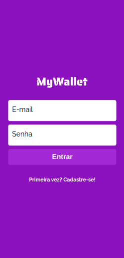
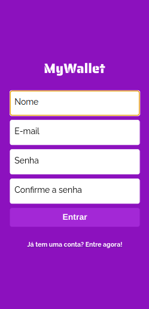
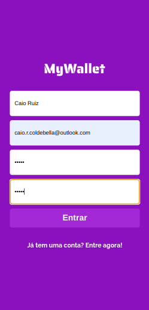
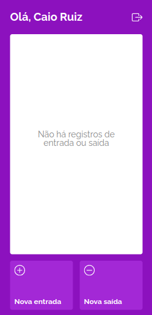
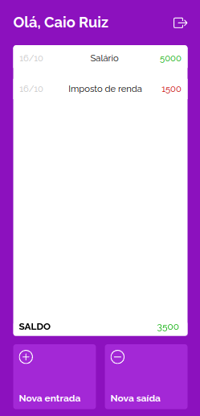

# MyWallet

## Description:

The project is an expense and earnings management application, simulating a wallet, where the user can create an account and perform authentication, check the entries and exits of their wallet, and insert new entries and exits. On the front-end, the site structure was divided into code through components, in addition context was used to store the token necessary to make requests from the back-end. In the back-end, the code was created following a layered architecture, with routers, middleware and controllers.

## Front-end

Made using React.js

* Login persistence check
* Access authenticated by token verification using uuid
* UseNavigate to change routes
* Transactions displayed on the home screen
* Addition of wallet entries and exits with transactions and balance stored in the database

## Back-end

Made using Node.js, Express.js, and MongoDB

* Using express Router to divide the backend layers into routers, middleware and controllers.
* Account creation with encrypted password using bcrypt
* Request validation in the backend using Joi

## Collections of MongoDB
The Database was divided by this manner:

### users
{ 
  name: string, 
  email: string, 
  password: string 
}

### wallet
{ 
  name: string, 
  total: number, 
  transactions: [ ] 
}

### sessions
{ 
  token: string, 
  userId: number, 
  lastStatus: Date 
}